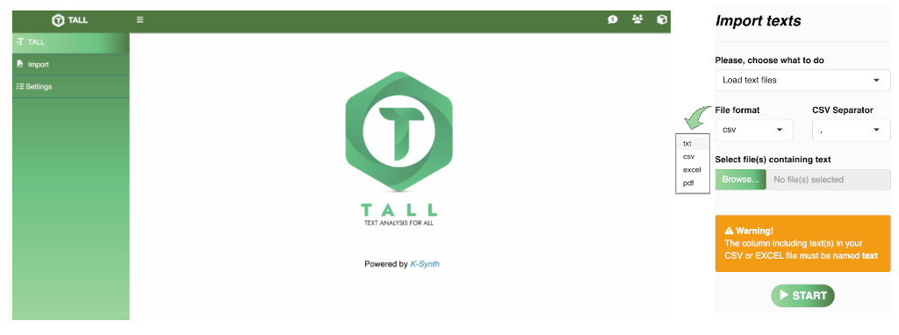
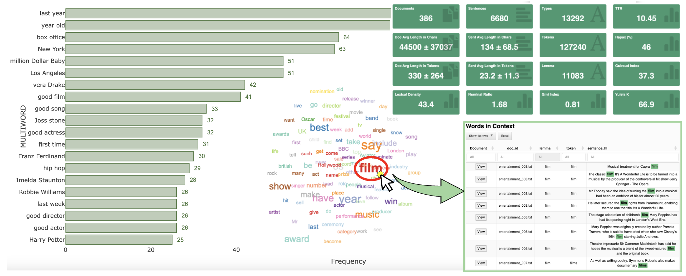

<!-- README.md is generated from README.Rmd. Please edit that file -->

# **TA*ll*** - **T**ext Analysis for **A*ll***

<!-- badges: start -->
<!-- badges: end -->

**TA*ll*** - **T**ext Analysis for **A*ll***, an R Shiny app that
includes a wide set of methodologies specifically tailored for various
text analysis tasks. It aims to address the needs of researchers without
extensive programming skills, providing a versatile and general-purpose
tool for analyzing textual data. With TA*ll*, researchers can leverage a
wide range of text analysis techniques without the burden of extensive
programming knowledge, enabling them to extract valuable insights from
textual data in a more efficient and accessible manner.

## Installation

You can install the development version of TA*ll* from
[GitHub](https://github.com/) with:

``` r
# install.packages("remotes")
remotes::install_github("massimoaria/tall")
```

## Introduction

In the age of information abundance, researchers across diverse
disciplines are confronted with the formidable task of analyzing
voluminous textual data. Textual data, encompassing research articles,
social media posts, customer reviews, and survey responses, harbors
invaluable insights that can propel knowledge advancement in various
fields, ranging from social sciences to healthcare and beyond.
Researchers endeavor to analyze textual data to unveil patterns, discern
trends, extract meaningful information, and gain deeper understandings
of diverse phenomena. By leveraging sophisticated natural language
processing (NLP) techniques and machine learning algorithms, researchers
can delve into the semantic and syntactic structures of texts, perform
topic detection, polarity detection, and text summarization, among other
analyses. Additionally, the advent of digital platforms and the
exponential growth of online content have generated unprecedented
volumes of textual data that were previously inaccessible or challenging
to acquire.

Researchers can harness the power of these textual resources to delve
into novel research questions, corroborate existing theories, and
generate groundbreaking insights. Through the utilization of
computational tools and methodologies, researchers can efficiently
process and analyze expansive volumes of text, substantially reducing
the time and effort expended compared to manual analysis. Furthermore,
there is a burgeoning recognition of the need for text analysis tools
tailored to individuals who may not possess in-depth programming
expertise. While programming languages like R and Python offer powerful
capabilities for data analysis, not all researchers have the time or
resources to acquire proficiency in these languages. To address this
challenge, a growing number of user-friendly text analysis tools have
emerged, providing researchers with a viable alternative to traditional
programming-based approaches. These tools empower researchers from
diverse backgrounds to effectively process and analyze textual data,
fostering a more inclusive research environment and democratizing access
to the transformative power of text analysis.

For researchers who lack programming skills, TA*ll* offers a viable
solution, providing an intuitive interface that allow researchers to
interact with data and perform analyses without the need for extensive
programming knowledge.

TA*ll* offers a comprehensive workflow for data cleaning,
pre-processing, statistical analysis, and visualization of textual data,
by combining state-of-the-art text analysis techniques into an R Shiny
app.

## TA*ll* workflow

First TA*ll* seamlessly integrates the functionalities of a suite of R
packages designed for NLP tasks with the user-friendly interface of web
applications through the Shiny package environment.

The TA*ll* workflow streamlines the discovery and analysis of textual
data by systematically processing and exploring its content. This
comprehensive framework empowers researchers with a versatile toolkit
for text analysis, enabling them to efficiently navigate and extract
meaningful insights from large volumes of textual data.

By leveraging the strengths of both R packages and Shiny’s interactive
web interface, TA*ll* provides a powerful and accessible platform for
researchers to conduct thorough the following workflow:

1.  **Import and Manipulation**

2.  **Pre-processing and Cleaning**

3.  **Statistical Text Analysis and Dynamic Visualization**


## Some screenshot from TA*ll*







## Authors

### Creators:

- **Massimo Aria**

  - email: aria@unina.it

  - ORCID: <https://orcid.org/0000-0002-8517-9411>

- **Corrado Cuccurullo**

  - email: cuccurullocorrado@gmail.com

  - ORCID: <https://orcid.org/0000-0002-7401-8575>

- **Luca D’Aniello**

  - email: luca.daniello@unina.it

  - ORCID: <https://orcid.org/0000-0003-1019-9212>

- **Maria Spano**

  - email: maria.spano@unina.it

  - ORCID: <https://orcid.org/0000-0002-3103-2342>

### Contributors

- Michelangelo Misuraca

  - email: michelangelo.misuraca@unical.it

  - ORCID: <https://orcid.org/0000-0002-8794-966X>

### Manteiners

Massimo Aria

## License

MIT License.

Copyright 2023 Massimo Aria

Permission is hereby granted, free of charge, to any person obtaining a
copy of this software and associated documentation files (the
"Software"), to deal in the Software without restriction, including
without limitation the rights to use, copy, modify, merge, publish,
distribute, sublicense, and/or sell copies of the Software, and to
permit persons to whom the Software is furnished to do so, subject to
the following conditions:

The above copyright notice and this permission notice shall be included
in all copies or substantial portions of the Software.

THE SOFTWARE IS PROVIDED "AS IS", WITHOUT WARRANTY OF ANY KIND, EXPRESS
OR IMPLIED, INCLUDING BUT NOT LIMITED TO THE WARRANTIES OF
MERCHANTABILITY, FITNESS FOR A PARTICULAR PURPOSE AND NONINFRINGEMENT.
IN NO EVENT SHALL THE AUTHORS OR COPYRIGHT HOLDERS BE LIABLE FOR ANY
CLAIM, DAMAGES OR OTHER LIABILITY, WHETHER IN AN ACTION OF CONTRACT,
TORT OR OTHERWISE, ARISING FROM, OUT OF OR IN CONNECTION WITH THE
SOFTWARE OR THE USE OR OTHER DEALINGS IN THE SOFTWARE.
